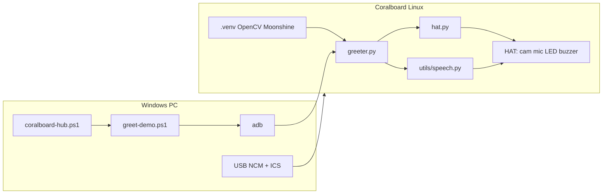
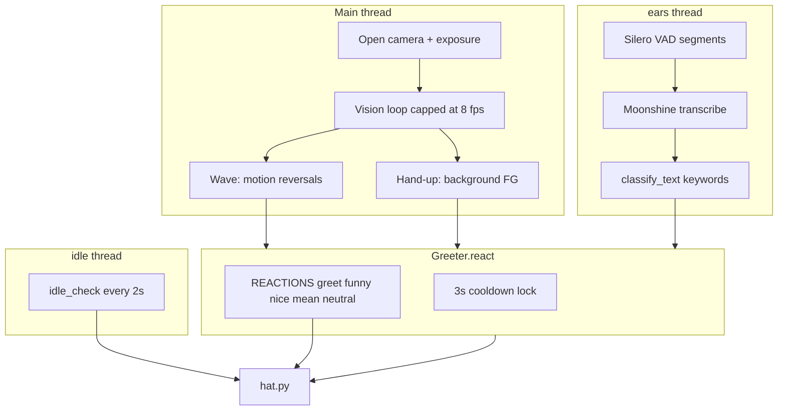
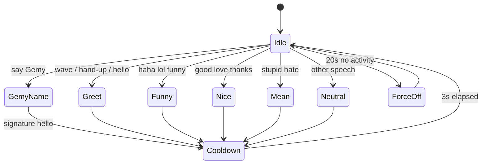

# Architecture

## System context



---

## `greeter.py` internal architecture



---

## Data flow: speech path

```
PDM microphone (HAT)
    → ALSA (klamath-asoc hw:0,0)
    → sounddevice InputStream
    → SileroSpeechSegmenter (utterance boundaries)
    → MoonshineTranscriber (text string)
    → classify_text() → kind: gemy|greet|funny|nice|mean|neutral
    → Greeter.react(kind)
    → hat.beep / hat.led / hat.rainbow / hat.r2d2
```

**Note:** Default ALSA device works in testing (`device=None`). Device `0` is the hardware capture device; both showed signal in RMS probes.

---

## Data flow: vision path

```
/dev/video0 (OV5647)
    → OpenCV VideoCapture
    → resize 320×240
    → gray + blur
    → |frame - prev|  → motion mask → wave logic
    → background model → upper-frame FG → hand-up logic
    → Greeter.greet() on wave or hand-up
```

Vision triggers always use reaction **`greet`** (double beep + green).

---

## Resource ownership

| Resource | Owner | Conflict if |
|----------|-------|-------------|
| `/dev/video0` | One process | `wave_detect.py` + `greeter.py` both running |
| GPIO buzzer line | Last `gpioset` | Stuck ON if not driven HIGH |
| ALSA capture | One `InputStream` | Rare duplicate if two speech apps run |
| CPU (2 cores) | Vision + STT compete | High `--fps` breaks speech |

---

## Reaction state machine (conceptual)



---

## Deployment layout on board

```
/home/root/
  greeter.py          # lab main
  hat.py              # hardware library
  hat_photo.jpg       # optional captures
  sl2610-examples/
    .venv/bin/python3
    utils/speech.py
    gemma_translate/  # official demos
```

---

## Security and scope notes (for reviewers)

- Lab assumes **trusted local USB** access (`adb` as root on board).
- No cloud API required after models are cached on board.
- ICS shares host internet; instructors should disclose network routing to students.
- Sentiment lexicons are intentionally naive — not suitable for production moderation.
