# Wave detection vs Gemma 3 — what actually runs where

A common question in this lab: *“Does Gemma 3 watch the camera and learn how to detect a wave?”*

**No.** The wave demo and Gemy’s vision use **classic computer vision** in this repo. **Gemma 3** is a separate **text** model on the board used for the **translation** demos. This page maps every “brain” so instructors, students, and reviewers do not mix them up.

---

## Quick map (three separate systems)

| What you do | What runs | Where the logic lives | Uses Gemma 3? |
|-------------|-----------|------------------------|---------------|
| Wave at the camera (`wave-demo.ps1`) | Motion + reversal counting | `board/python/wave_detect.py` | **No** |
| Wave / hand-up in full Gemy (`greet-demo.ps1`) | Same vision math + reaction dispatcher | `board/python/greeter.py` → `vision_loop()` | **No** |
| Say “hello”, “Gemy”, jokes, insults, etc. | Moonshine STT → **Gemma 3 mood** (+ keyword fallback) | `greeter.py` + `gemma_mood.py` | **Yes** (text mood) |
| English → Spanish/French/Italian | Gemma 3 270M instruct + translation prompt | On-board **`/home/root/sl2610-examples/gemma_translate/`** (Synaptics examples bundle) | **Yes** |

**Shared hardware only:** Gemy’s ears reuse the **same microphone + Moonshine + Silero VAD stack** as the official Gemma **voice** demo (`connect-gemma.ps1`). That is speech-to-text infrastructure — not Gemma reading video.

---

## 1. Wave detector — no training, no LLM

### Where the code lives

| File | Role |
|------|------|
| [`board/python/wave_detect.py`](../../board/python/wave_detect.py) | Standalone wave-only demo → `hat.beep(2)` |
| [`board/python/greeter.py`](../../board/python/greeter.py) | Full Gemy: copies the same wave math inside `vision_loop()` |
| [`windows/demos/wave-demo.ps1`](../../windows/demos/wave-demo.ps1) | Pushes `wave_detect.py`, runs it over ADB |

Nothing in these files loads Gemma, calls the NPU for vision, or sends camera frames to an LLM.

### How a “wave” is defined (algorithm)

The camera runs at full capture rate, but processing uses **grayscale**, **blur**, and **frame differencing**:

1. `absdiff(current_gray, previous_gray)` → threshold → dilate → motion mask.
2. If enough pixels moved, record the **horizontal center** of motion (`cx`, normalized 0–1 across the frame).
3. Keep centers in a **time window** (~2 s).
4. Count **left↔right reversals** in that window (with hysteresis so jitter does not count).
5. If reversals ≥ preset **and** horizontal **span** is wide enough → treat as a wave → beep twice.

Sensitivity presets (`low` / `medium` / `high`) only change numeric thresholds — not a neural network:

```69:74:board/python/wave_detect.py
SENSITIVITY = {
    #            min_motion  reversals  min_step  window
    "low":      (0.010,      4,         0.10,     2.0),
    "medium":   (0.005,      3,         0.08,     2.2),
    "high":     (0.003,      3,         0.06,     2.5),
}
```

**Hand held up** (Gemy only): a separate branch uses a **running background model** and looks for a **still** foreground blob in the **upper 55%** of the frame for ~0.7 s — again OpenCV only, in `greeter.py` `vision_loop()`.

### Why not Gemma 3 (or any vision LLM) for waves?

- The board’s **`gemma-3-270m-it`** model is **text-in / text-out** only — no image input.
- Vision on the Coral NPU is meant for bundled demos like **MobileNet classification** and **YOLO detection**, not ad-hoc “wave at me” gestures.
- OpenCV motion is **fast**, **predictable for teaching**, and runs on the CPU without competing with the mic for NPU time.

For production-style vision you would use the NPU object-detection demo; for a lab wave, deterministic motion is intentional.

---

## 2. Gemy’s voice “personality” — keywords first, Gemma assist second

When you speak to Gemy:

| Step | Component | Location |
|------|-----------|----------|
| Capture audio | `SoundDeviceAudioSource` | `sl2610-examples/utils/speech.py` |
| Find speech vs silence | Silero VAD | same |
| Speech → text | **Moonshine** STT | same |
| Text → mood (fast) | Keyword rules | `greeter.py` `classify_keywords()` |
| Text → mood (if unclear) | **Gemma 3** worker (optional) | `gemma_mood.py` + `gemma_mood_worker.py` |
| Safe label | `mood_for_reaction` / `resolve_reaction_kind` | unknown → **neutral** |
| Mood → lights/sound | `hat.gemy_*()` + `Greeter.react()` | `greeter.py`, `hat.py` |

**Wave detection still does not use Gemma.** Only **heard text** can use Gemma — and only when keywords do not match.

- PC default: **`--gemma-mood`** (assist on unclear phrases).
- Boot / stable path: **`--no-gemma-mood`** (keywords only).
- **`--gemma-mood-serial` is disabled** (NPU freeze risk).

Moonshine loads in ~10–20 s; Gemma loads **lazily** on first unclear phrase (up to ~1–3 min once). Jokes should hit keywords → **rainbow** without waiting for Gemma.

Full mood table: [08-GEMY-MOODS-AND-REACTIONS.md](08-GEMY-MOODS-AND-REACTIONS.md). Prompt: `board/python/gemma_mood.py` (`_MOOD_PROMPT`).

---

## 3. Gemma 3 — where translation behavior is defined

Gemma 3 is used when you run the **official translation demos**, not the wave detector.

### Entry points from this repo

| Launcher | On-board command | Purpose |
|----------|------------------|---------|
| [`connect-gemma.ps1`](../../connect-gemma.ps1) | `gemma_translate/cli_translate.py` | Interactive voice: listen → translate |
| [`board/python/gemma_text.py`](../../board/python/gemma_text.py) | Uses `GemmaTranslationService` | One-shot text translation (helper) |

`gemma_text.py` loads the instruct model and delegates to Synaptics’ service:

```27:34:board/python/gemma_text.py
    print("Loading Gemma 3 270M (Torq/NPU)...")
    backend = load_gemma(use_llama=False, model_path=None, instruct_model=True)
    svc = GemmaTranslationService(backend)

    print(f"\nInput (English): {text}")
    print(f"Target language: {lang}\n")
    result = svc.translate(text, target_language=lang)
```

### Where “how Gemma should behave” is configured (on the board)

The **prompt templates**, language menu, and CLI flow live in the **preinstalled examples tree**, not in `wave_detect.py`:

```
/home/root/sl2610-examples/
  utils/gemma.py              # load_gemma(), NPU clock
  gemma_translate/
    translation.py            # GemmaTranslationService — builds prompts, calls model
    cli_translate.py          # voice interactive demo (connect-gemma.ps1)
    common_args.py            # LANGUAGES dict (Spanish, French, Italian, …)
```

To inspect the actual instruction text sent to Gemma 3 (instructor / advanced):

```bash
adb shell
grep -n "prompt\|translate\|instruct" /home/root/sl2610-examples/gemma_translate/translation.py | head -40
# or open the whole file:
cat /home/root/sl2610-examples/gemma_translate/translation.py
```

Typical pattern: English user text is wrapped in an **instruct-style prompt** (“translate to {language} …”) inside `GemmaTranslationService.translate()`. Adding a language means editing **`common_args.py`** on the board (see [CORALBOARD-GUIDE.md](../CORALBOARD-GUIDE.md)).

**This repo does not vendor `sl2610-examples`.** We document how to launch it and provide `gemma_text.py` as a thin wrapper. Workshop **submission** materials should point reviewers to Synaptics’ bundle for Gemma prompt source.

---

## 4. System diagram

```mermaid
flowchart TB
  subgraph vision ["Vision path — NO Gemma"]
    CAM["/dev/video0 OV5647"]
    CV["OpenCV motion + background"]
    WD["wave_detect.py OR greeter vision_loop"]
    HAT1["hat.py beep / LEDs"]
    CAM --> CV --> WD --> HAT1
  end

  subgraph gemy_voice ["Gemy voice path — Moonshine + keywords"]
    MIC["HAT PDM mic"]
    VAD["Silero VAD"]
    MS["Moonshine STT"]
    KW["greeter.py classify_text"]
    RX["REACTIONS / react"]
    HAT2["hat.py"]
    MIC --> VAD --> MS --> KW --> RX --> HAT2
  end

  subgraph gemma_demo ["Gemma 3 path — translation only"]
    MIC2["HAT mic or typed text"]
    MS2["Moonshine STT optional"]
    GT["gemma_translate/ GemmaTranslationService"]
    NPU["Gemma 3 270M on NPU"]
    OUT["Translated text"]
    MIC2 --> MS2 --> GT --> NPU --> OUT
  end
```



---

## 5. Code jam — what to say out loud

| Step | Say this | Avoid saying |
|------|----------|--------------|
| **Step 4 — wave** | “We’re teaching the camera **math**: motion left-right. No AI model training.” | “Gemma watches you wave.” |
| **Step 5 — voice** | “Moonshine hears you; **Gemma 3 on the NPU** picks funny / mean / nice / etc.” | “Gemma watches the camera.” |
| **Hub button 7 — Gemma** | “This is the **official translation** demo — a different project path.” | “This is how the wave works.” |

If voice works for waves but not speech, the usual bug is **`wave_detect.py` still running** (camera stolen, no mic path) — not Gemma misconfiguration. See [04-TROUBLESHOOTING.md](04-TROUBLESHOOTING.md).

---

## 6. Related docs

| Doc | Topic |
|-----|--------|
| [02-HOW-WE-CODED-IT.md](02-HOW-WE-CODED-IT.md) | Implementation detail for `hat.py`, `greeter.py` |
| [03-ARCHITECTURE.md](03-ARCHITECTURE.md) | Threads, resources, state machine |
| [CORALBOARD-GUIDE.md](../CORALBOARD-GUIDE.md) | Operator commands, Gemma demo setup |
| [ai-prompt-walkthrough/02-prompt-journey.md](ai-prompt-walkthrough/02-prompt-journey.md) | Step-by-step prompts |
