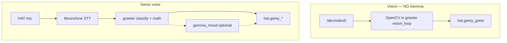

# Wave detection vs Gemma 3 — what actually runs where

**Common question:** *“Does Gemma 3 watch the camera and detect waves?”*

**No.** Gemy’s vision is **OpenCV motion math** in `greeter.py`. **Gemma 3 270M** on this board is **text-in / text-out** only — used for optional **mood assist** and (separately) Synaptics **translation** demos on the board.

**Gemma 4 does not run on Coralboard** (2 GB RAM; stack targets Gemma 3 270M).

---

## Quick map

| What you do | What runs | Where | Gemma? |
|-------------|-----------|-------|--------|
| Wave / hand-up with Gemy | OpenCV motion + background FG | `greeter.py` → `vision_loop()` | **No** |
| Say hello, jokes, insults, math | Moonshine STT → **keywords** → optional Gemma mood | `greeter.py`, `gemma_mood*.py` | **Assist only** |
| Simple math (“7 times 6 equals 42”) | Deterministic rules in `greeter.py` | `_try_math_yes_no()` | **No** |
| English → Spanish (Synaptics demo) | Gemma 3 translation service | `/home/root/sl2610-examples/gemma_translate/` | **Yes** (separate demo) |

This repo ships **Gemy** (`greeter.py`, `hat.py`, Control Center). It does **not** ship standalone `wave_detect.py`, `wave-demo.ps1`, `connect-gemma.ps1`, or WebRTC launchers — those were removed; vision is **inside greeter only**.

---

## 1. Vision — OpenCV in `greeter.py`

Wave and hand-up run in **`vision_loop()`** when you start **Gemy — camera + voice**.

1. Grayscale frames, blur, frame differencing → motion mask.
2. Track horizontal motion centers over ~2 s; count **left↔right reversals** → wave.
3. **Hand-up:** background model + still blob in upper 55% of frame ~0.7 s.

Sensitivity: `--sensitivity low|medium|high` (threshold presets only — not neural nets).

Wave/hand-up → reaction **`greet`** (rainbow + beep). **No Gemma, no NPU for vision.**

---

## 2. Voice — Moonshine + deterministic guards

```
Mic → Silero VAD → Moonshine STT → text string
  → classify_utterance (keywords, yes/no, math, jokes, …)
  → optional Gemma mood assist (if --gemma-mood and unclear)
  → resolve_reaction_kind (unknown → neutral)
  → hat.gemy_*()
```

| Layer | Role |
|-------|------|
| **Moonshine** | Speech → text only |
| **`greeter.py`** | All deterministic mood/math/joke logic |
| **`gemy_stability.py`** | NPU sharing, listen timeouts, Gemma rate limits |
| **`gemma_mood.py`** | Optional text → one mood label |

**Gemma never runs before keywords.** Math quizzes (`plus`, `times`, follow-up “is it equal to 42”) are **rules in Python**, not Moonshine or Gemma.

Full mood table: [08-GEMY-MOODS-AND-REACTIONS.md](08-GEMY-MOODS-AND-REACTIONS.md).

---

## 3. Gemma 3 translation (optional, on board only)

Not part of Gemy. Lives in the preinstalled examples tree:

```
/home/root/sl2610-examples/gemma_translate/
  translation.py      # prompts + GemmaTranslationService
  cli_translate.py    # interactive voice demo
  common_args.py      # language menu
```

Run from the board (venv activated) per Synaptics docs, or explore via `adb shell`. This repo does not include a Windows launcher for translation.

---

## 4. Diagram



---

## 5. Teaching one-liners

| Say | Avoid |
|-----|--------|
| “Camera **math** sees waves — no AI training.” | “Gemma watches you wave.” |
| “Moonshine **hears**; **Python rules** pick most moods.” | “The LLM drives every reaction.” |
| “Gemma **helps** when phrasing is unclear.” | “Gemma runs everything.” |

If voice fails after camera worked: run **`cleanup-board.ps1`**, restart Gemy — stale `greeter` or a busy `/dev/video0` is the usual cause. See [04-TROUBLESHOOTING.md](04-TROUBLESHOOTING.md).

---

## Related

| Doc | Topic |
|-----|--------|
| [08-GEMY-MOODS-AND-REACTIONS.md](08-GEMY-MOODS-AND-REACTIONS.md) | Moods, flags, stability |
| [02-HOW-WE-CODED-IT.md](02-HOW-WE-CODED-IT.md) | Implementation |
| [CORALBOARD-GUIDE.md](../CORALBOARD-GUIDE.md) | Operator commands |
